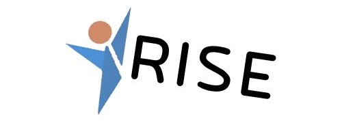

# RISE 

By Jishnu Mehta, Ria Agarwal  
Woodinville High School  
Woodinville, WA  
2023-2024 Mobile App Development National Champions

RISE, available on both iOS and Android, is a portfolio application designed to assist high school students in planning their futures, from college applications to resume development and beyond. Created for the FBLA Mobile Application 2023-2024 event, RISE enables students to create a personalized portfolio showcasing their high school experiences, including athletics, art, clubs, community service, classes, awards, and more.

The app features a sleek, intuitive UI and leverages Firebase for robust database and authentication services. Users can create aesthetic, professional resumes to represent their experiences, which can be printed or shared on social media. Integration with various LinkedIn APIs, from creating posts to exporting experiences to LinkedIn profiles, further streamlines the process of connecting students with future opportunities.

Prioritizing safety and privacy, RISE collects minimal personal information and adheres to best security practices, using data solely for app functionality. To foster personal vision and goal-setting habits, the app includes unique goals and analytics tools based on research-backed methods, helping students set and track their goals effectively.

Download the app today and RISE up towards your future!


## Features:
- Designed for Android and iOS devices
- Printable PDF version of portfolio
- Share a file of the portfolio to social media apps like Instagram and Facebook
- Create goals
- Track progress of goals
- Track how many goals are completed
- Track how many goals are in each category
- Visualize data in charts
- Add sections to your portfolio as needed with image attachments
- Remove experiences
- Create a portfolio
- Update user data
- Check which tiles are visible
- Reset the app


## Folder Layout:


**/lib**  
> This folder contains all the files that create the app. It has a folder in it for all the files for the goals page and a folder for all the files for the profile page, as well as single files for the rest of the pages of the app.

**/compiled_app**
> Contains old and new apk versions of tha app as well as a documentation PDF.  

**/assets**
> This folder includes all images used in the app.

**/android**
> This folder contains all the information to make the app usable on android devices.

**/ios**
> This folder contains all the information to make the app usable on ios devices.

## Instructions to Run:
### Tech Stack:

Flutter                 | App Development Framework  
VS Code                 | IDE  
Android Studio, Chrome  | Supports Flutter Testing  
GitHub                  | VCS  
Javascript, Render      | Web Server Script and Deployment
Firebase                | Auth and Database Services

To use our app, download app-release.apk in the compliled_app folder and open it to install.

### Build Requirements:
**Programming Language:** Dart  
**Framework:** Flutter  
**Development Environment:** Visual Studio Code (VS Code)  
**Platform:** Android, iOS, limited web functionality  
**Dependencies:**
- image_picker: ^1.0.2
- pdf: ^3.10.8
- printing: ^5.12.0
- cupertino_icons: ^1.0.6
- provider: ^6.1.2
- google_fonts: ^6.2.0
- intl: ^0.19.0
- path_provider: ^2.1.3
- path: ^1.9.0
- flutter_expandable_fab: ^2.0.0
- fl_chart: ^0.67.0
- share_plus: ^9.0.0
- pdfx: ^2.6.0
- dot_navigation_bar: ^1.0.2
- firebase_core: ^3.0.0
- firebase_auth: ^5.0.0
- cloud_firestore: ^5.0.1
- http: ^1.2.1
- url_launcher: ^6.3.0
- uni_links: ^0.5


 
## Getting Started
To use this project, follow these steps:

Clone the Repository:
````
git clone https://github.com/Ria-ag/Mobile_App_FBLA
````

Navigate to Project Directory:  
````
cd Mobile_App_FBLA
````

Install Dependencies:  
````
flutter pub get
````

Run the App:  
````
flutter run
````

## Other Resources Used  
**Software**  
Dart, Javascript, Git, Procreate, Figma

## License
MIT License

Copyright (c) 2024 RISE

Permission is hereby granted, free of charge, to any person obtaining a copy of this software and associated documentation files (the "Software"), to deal in the Software without restriction, including without limitation the rights to use, copy, modify, merge, publish, distribute, sublicense, and/or sell copies of the Software, and to permit persons to whom the Software is furnished to do so, subject to the following conditions:

The above copyright notice and this permission notice shall be included in all copies or substantial portions of the Software.

THE SOFTWARE IS PROVIDED "AS IS”, WITHOUT WARRANTY OF ANY KIND, EXPRESS OR IMPLIED, INCLUDING BUT NOT LIMITED TO THE WARRANTIES OF MERCHANTABILITY, FITNESS FOR A PARTICULAR PURPOSE, AND NON-INFRINGEMENT. IN NO EVENT SHALL THE AUTHORS OR COPYRIGHT HOLDERS BE LIABLE FOR ANY CLAIM, DAMAGES OR OTHER LIABILITY, WHETHER IN AN ACTION OF CONTRACT, TORT OR OTHERWISE, ARISING FROM, OUT OF OR IN CONNECTION WITH THE SOFTWARE OR THE USE OR OTHER DEALINGS IN THE SOFTWARE.
